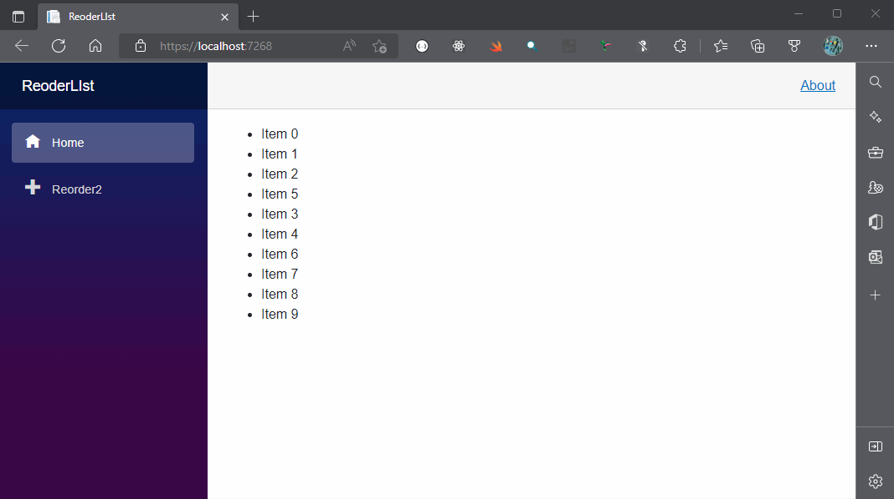
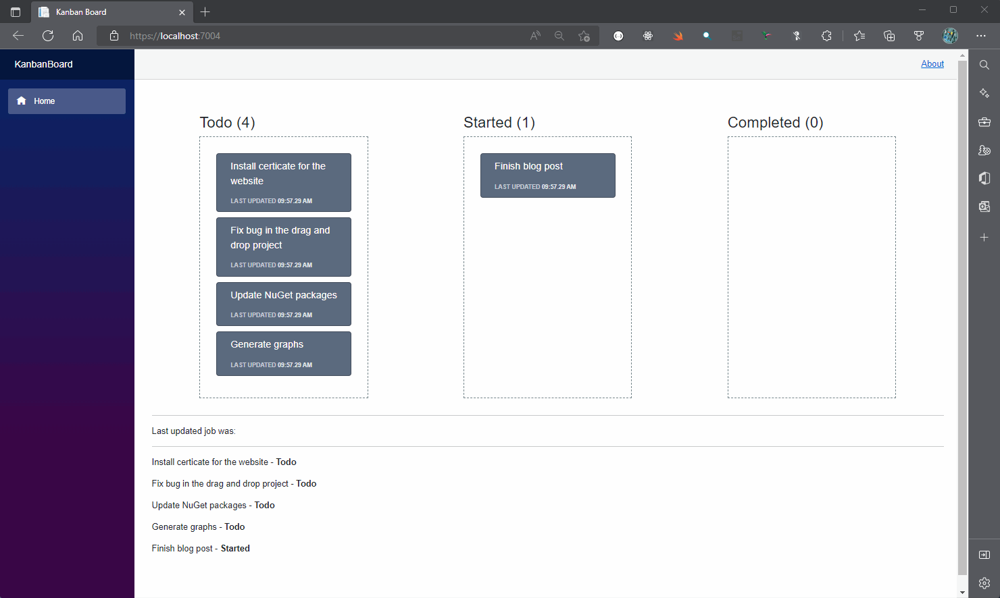

# Drag & Drop with Blazor
I show how to implement drag and drop with [Blazor WebAssembly](https://www.puresourcecode.com/tag/blazor-webassembly/) and [Blazor Server](https://www.puresourcecode.com/tag/blazor-server/). 
It's common to find drag and drop interfaces in productivity tools, great examples of this is [Azure DevOps](https://www.puresourcecode.com/tools/azure-devops/azure-devops-processes/). 
As well as being an intuitive interface for the user, it can definitely add a bit of "eye-candy" to an application.

## Screenshots

### Reorder list

### Kanban board

